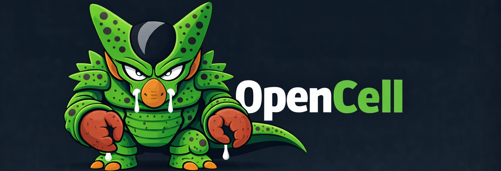

<div align="center">



# OpenCell (Ulf-Warden)

> **🤖 Open-Source Multi-Agent AI Platform - Your Own AI Agent Army**

[](https://github.com/cloudwalk/opencell)
[](LICENSE)
[](https://cloud.google.com/kubernetes-engine)
[](https://anthropic.com)
[](https://moonshot.cn)
[]()
[](https://typescriptlang.org)

</div>

**OpenCell** (Ulfberht-Warden) is a production-ready multi-agent AI platform that runs on YOUR infrastructure. Deploy unlimited specialized AI agents across Slack, Discord, Telegram, and WhatsApp.

---

## 🚀 NEW in v2.0 (February 2025)

### 🌙 **Moonshot AI Integration** - 97% Cost Savings!
- Alternative LLM provider with 2M token context (10x larger than Claude)
- **$0.50 per million tokens** vs Claude's $3-15/Mtok
- Drop-in replacement - same tools, same features
- Perfect for high-volume deployments
- 📖 [Moonshot Provider Docs](docs/moonshot-provider.md)

### 🤖 **Bot Factory** - Create Bots on Demand
- Create specialized bots via Discord conversation: `!roundtable create bot guardian`
- Two bot types: Conversational (chat) or Agent (with coding tools)
- Dynamic deployment to Kubernetes in ~30 seconds
- Each bot has unique personality and tool access
- 📖 [Bot Factory Guide](docs/bot-factory-pi-integration.md) • [Examples](examples/bot-factory-examples.md)

### 🎯 **RoundTable Multi-Agent System**
- 5-6 specialized agents deliberate together before responding
- 3 phases: Discussion → Proposals → Democratic Voting
- Agents: Analyst, Creative, Skeptic, Pragmatist, Ethicist, Summarizer
- 4 voting rules: Majority, Unanimity, Rated, Ranked
- Perfect for complex decisions and trade-off analysis
- 📖 [RoundTable Docs](docs/roundtable-system.md)

### 🔌 **Model Context Protocol (MCP)** - Plug & Play Tools
- Connect to 100+ MCP servers with zero coding
- GitHub, Slack, Postgres, Brave Search, Google Maps, and more
- Add new integration in 3 lines of config
- Auto-discovery of tools and capabilities
- 📖 [MCP Integration Guide](docs/mcp-integration.md)

---

## 🎯 What is OpenCell?

OpenCell is your **private AI agent platform** that:

- ✅ **Runs on YOUR infrastructure** - Full control, no vendor lock-in
- ✅ **Multi-platform** - Slack, Discord, Telegram, WhatsApp
- ✅ **Multi-agent** - Create unlimited specialized bots
- ✅ **Production-hardened** - 7-layer security, rate limiting, audit trails
- ✅ **Cost-optimized** - Switch between Claude, Moonshot, local models
- ✅ **Extensible** - MCP protocol for instant integrations

---

## ⚡ Quick Start

```bash
# 1. Clone and install
git clone https://github.com/cloudwalk/opencell.git
cd opencell
npm install

# 2. Configure
cp .env.example .env
# Add your API keys to .env

# 3. Run
npm run build
npm start

# 4. Use in Discord/Slack
@Ulf hello!
```

**That's it!** Your AI agent is running. 🎉

---

## 🌟 Core Features

### 🤖 **Multi-Platform Chat**
- **Slack** - Socket Mode, threads, reactions, channel management
- **Discord** - Rich embeds, buttons, voice support, mobile-friendly
- **Telegram** - Inline keyboards, media support, bot API
- **WhatsApp** - QR auth, group support, media handling
- **Isolated Sessions** - Separate history per user per platform

### 🧠 **Multi-Agent Architecture**

#### 1. Bot Factory - Dynamic Bot Creation
```
@Ulf create agent bot named devops
  personality: Kubernetes expert
  tools: kubectl, bash, read

# Creates new bot in 30 seconds!
@devops check all pods in production
```

**Features:**
- 💬 **Conversational bots** (chat only) - Fast, cheap, safe
- 🤖 **Agent bots** (with tools) - Can execute commands, read files, use kubectl
- Tool whitelist per bot (bash, read, write, kubectl, gcloud, git)
- Automatic persona formatting with emojis and role badges
- 📖 [Bot Factory Docs](docs/bot-factory-pi-integration.md)

#### 2. RoundTable - Multi-Agent Deliberation
```
@Ulf !roundtable Should we use MongoDB or PostgreSQL?

# 5 agents discuss, propose solutions, vote democratically
# Winner: Hybrid approach (60% consensus)
```

**Agents:**
- 📊 **Analyst** - Data-driven insights
- 💡 **Creative** - Innovative solutions
- 🔍 **Skeptic** - Risk identification
- 🔧 **Pragmatist** - Practical implementation
- ⚖️ **Ethicist** - Ethical evaluation
- 📝 **Summarizer** - Consensus building

**Voting Rules:** Majority, Unanimity, Rated (1-5 stars), Ranked (Borda count)

📖 [RoundTable Docs](docs/roundtable-system.md)

### 🔌 **MCP Integration - Plug & Play Tools**

Connect to external services without coding:

```json
// mcp.json
{
  "brave-search": {
    "command": "npx",
    "args": ["-y", "@modelcontextprotocol/server-brave-search"],
    "env": { "BRAVE_API_KEY": "${BRAVE_API_KEY}" }
  }
}
```

**Available Servers:**
- 🔍 Brave Search (web search)
- 🐙 GitHub (issues, PRs, code search)
- 🗄️ PostgreSQL (database queries)
- 🗺️ Google Maps (geocoding, directions)
- 💬 Slack (send messages, manage channels)
- 🌐 Puppeteer (browser automation)
- 📁 Filesystem (file operations)
- 🧠 Memory (persistent storage)

**100+ more servers available** in [MCP ecosystem](https://github.com/modelcontextprotocol/servers)

📖 [MCP Docs](docs/mcp-integration.md) • [Config Examples](mcp.json)

### 🌙 **Moonshot AI Provider - 97% Cheaper**

Switch to Moonshot for massive cost savings:

```bash
# .env
LLM_PROVIDER=moonshot
MOONSHOT_API_KEY=sk-xxx
MOONSHOT_MODEL=kimi-k2.5
```

**Comparison:**

| Feature | Claude | Moonshot | Savings |
|---------|--------|----------|---------|
| Context | 200k tokens | 2M tokens | **10x** |
| Cost per Mtok | $3-15 | $0.50 | **97%** 💰 |
| Portuguese | ⭐⭐⭐⭐ | ⭐⭐⭐⭐⭐ | Better |
| Tools | ✅ | ✅ | Same |

**Monthly Cost Example:**
- 10M tokens with Claude: ~$150/month
- 10M tokens with Moonshot: ~$5/month
- **Annual Savings: $1,740** 💰

📖 [Moonshot Provider Docs](docs/moonshot-provider.md) • [Quick Start](examples/moonshot-quick-start.md)

### 🛡️ **Production-Hardened Security**

**7-layer defense** addressing critical vulnerabilities:

```
User Input → [1] Rate Limit → [2] Sanitize → [3] Blocklist →
[4] Pattern Vet → [5] AI Vet → [6] Execute → [7] Gateway
```

**Security Layers:**
1. **Rate Limiting** - 30 req/min per user
2. **Input Sanitizer** - 8+ attack patterns blocked
3. **Tool Blocklist** - Dangerous tools disabled
4. **Pattern Vetter** - Regex validation
5. **AI Vetter** - Intent analysis by Claude Haiku
6. **Secure Executor** - 30s timeout, 5 concurrent max
7. **AI Gateway** - Cloudflare WAF + DDoS protection

📖 [Security Architecture](docs/security/SECURITY_ARCHITECTURE.md) • [Comparison](docs/CLAWDBOT_COMPARISON.md)

### 💰 **Cost Auditor**

Real-time cost monitoring across platforms:

- **Anthropic** - Claude API token usage
- **Moonshot** - Kimi API usage
- **Google Cloud** - GKE cluster costs
- **ElevenLabs** - TTS character usage
- **Replicate** - Image generation
- **OpenAI** - DALL-E, GPT, Whisper

**Features:**
- Budget limits with intelligent alerts
- End-of-month projections
- Automatic optimization suggestions
- Historical data with visualizations
- Grafana dashboards

📖 [Cost Auditor Docs](cost-auditor/README.md)

### 🎨 **Multimodal Capabilities**

- **Image Generation** - Replicate (Flux, SDXL), OpenAI (DALL-E)
- **Video Generation** - Text-to-video, image animation
- **Audio/TTS** - ElevenLabs with 9+ voices
- **Transcription** - Whisper audio-to-text
- **Image Analysis** - GPT-4 Vision
- **Voice Channels** - Discord voice support

### 🧠 **Self-Improvement System**

Agents learn from interactions:

- **Automatic Learning** - Extracts insights from conversations
- **Memory Management** - Auto-compresses knowledge
- **Performance Tracking** - Success rates, user satisfaction
- **Personality Evolution** - Human-approved improvements

📖 [Self-Improvement Docs](docs/SELF_IMPROVEMENT.md)

### 🔧 **Developer Tools**

- **GitHub Integration** - Clone repos, manage issues/PRs
- **Web Scraping** - Brave Search, Playwright, Puppeteer
- **File Operations** - Read, write, edit, list
- **Shell Execution** - Security-filtered command execution
- **Database Access** - PostgreSQL, MySQL (via MCP)

---

## 📚 Documentation

### Getting Started
- 🚀 [Quick Start Guide](docs/GKE_QUICKSTART.md)
- 📦 [Installation](docs/INSTALLATION.md)
- ⚙️ [Configuration](docs/CONFIGURATION.md)

### New Features (v2.0)
- 🌙 [Moonshot AI Provider](docs/moonshot-provider.md)
- 🤖 [Bot Factory + Pi Integration](docs/bot-factory-pi-integration.md)
- 🎯 [RoundTable Multi-Agent](docs/roundtable-system.md)
- 🔌 [MCP Integration](docs/mcp-integration.md)
- 👥 [Bot Persona System](docs/bot-persona-system.md)

### Core Features
- 🛡️ [Security Architecture](docs/security/SECURITY_ARCHITECTURE.md)
- 💰 [Cost Auditor](cost-auditor/README.md)
- 🧠 [Self-Improvement](docs/SELF_IMPROVEMENT.md)
- 🎨 [Discord Formatting](docs/discord-formatting-integration.md)
- 🔑 [Secrets Management](docs/GKE_SECRETS.md)

### Deployment
- ☸️ [GKE Deployment](docs/GKE_QUICKSTART.md)
- 🐳 [Docker Setup](Dockerfile)
- 🔄 [CI/CD Pipeline](.github/workflows/)

### Comparisons
- 🆚 [vs ClawdBot](docs/CLAWDBOT_COMPARISON.md)
- 🆚 [vs OpenClaw Security](docs/OPENCLAW_SECURITY_COMPARISON.md)

### Examples
- 📖 [Bot Factory Examples](examples/bot-factory-examples.md)
- 🌙 [Moonshot Quick Start](examples/moonshot-quick-start.md)
- 🎯 [RoundTable Examples](examples/roundtable-examples.md)
- 🔌 [MCP Integration](examples/mcp-integration-example.ts)

---

## 🎮 Usage Examples

### Basic Chat
```
@Ulf hello, how are you?
@Ulf what's the weather in São Paulo?
@Ulf summarize this document [attach file]
```

### Bot Factory
```
# Create conversational bot
@Ulf create bot named support
  personality: friendly customer support agent

# Create agent bot with tools
@Ulf create agent bot named devops
  tools: kubectl, bash, read
  personality: Kubernetes expert

# List bots
@Ulf list all bots

# Check status
@Ulf check status of devops
```

### RoundTable Deliberation
```
# Start discussion
@Ulf !roundtable Should we migrate to microservices?

# With options
@Ulf !roundtable Database choice --voting rated --rounds 3 --team full
```

### MCP Commands
```
# Check MCP status
!mcp status

# List available servers
!mcp servers

# List all tools
!mcp tools

# Tools from specific server
!mcp tools brave-search
```

### Multimodal
```
@Ulf generate an image of a futuristic city
@Ulf analyze this screenshot [attach image]
@Ulf transcribe this audio [attach audio]
@Ulf speak "hello world" in voice channel
```

---

## 🚢 Deployment

### Local Development
```bash
npm install
npm run build
npm start
```

### Docker
```bash
docker build -t opencell:latest .
docker run -e ANTHROPIC_API_KEY=xxx opencell:latest
```

### Kubernetes (GKE)
```bash
# Configure GCP
gcloud config set project YOUR_PROJECT

# Deploy
./scripts/gke-deploy.sh

# Verify
kubectl get pods -n ulf
kubectl logs -n ulf deployment/ulf-warden -f
```

📖 [Complete Deployment Guide](docs/GKE_QUICKSTART.md)

---

## ⚙️ Configuration

### Minimum (.env)
```bash
# LLM Provider
ANTHROPIC_API_KEY=sk-ant-api03-xxx

# OR Moonshot (cheaper!)
LLM_PROVIDER=moonshot
MOONSHOT_API_KEY=sk-xxx

# Platform (choose one or more)
DISCORD_BOT_TOKEN=xxx
SLACK_BOT_TOKEN=xoxb-xxx
SLACK_APP_TOKEN=xapp-xxx
TELEGRAM_BOT_TOKEN=xxx
```

### Full Configuration
See [.env.example](.env.example) for all options including:
- Security settings (rate limits, blocklists)
- Cost limits (daily, monthly, annual)
- Platform-specific config
- MCP server credentials
- Multimodal API keys

---

## 🔧 Architecture

```
┌──────────────────────────────────────────────────────────┐
│                    User Interfaces                        │
│     Slack • Discord • Telegram • WhatsApp                │
└───────────────────┬──────────────────────────────────────┘
                    │
┌───────────────────▼──────────────────────────────────────┐
│              OpenCell Core Engine                         │
│  ┌──────────┐  ┌──────────┐  ┌──────────┐  ┌─────────┐ │
│  │ Router   │  │ Ulf Main │  │ Bot      │  │Round    │ │
│  │          │  │ Agent    │  │ Factory  │  │Table    │ │
│  └──────────┘  └──────────┘  └──────────┘  └─────────┘ │
└───────────────────┬──────────────────────────────────────┘
                    │
┌───────────────────▼──────────────────────────────────────┐
│              LLM Providers (Multi-provider)               │
│  ┌─────────┐  ┌──────────┐  ┌────────┐  ┌────────────┐ │
│  │ Claude  │  │ Moonshot │  │ Ollama │  │ Local      │ │
│  │ (API)   │  │ (Kimi)   │  │        │  │ Models     │ │
│  └─────────┘  └──────────┘  └────────┘  └────────────┘ │
└───────────────────┬──────────────────────────────────────┘
                    │
┌───────────────────▼──────────────────────────────────────┐
│              Tools & Integrations                         │
│  ┌─────────┐  ┌──────────┐  ┌────────┐  ┌────────────┐ │
│  │ Native  │  │ MCP      │  │ Pi     │  │ GitHub     │ │
│  │ Tools   │  │ Servers  │  │ Agent  │  │ API        │ │
│  └─────────┘  └──────────┘  └────────┘  └────────────┘ │
└──────────────────────────────────────────────────────────┘
```

📖 [Detailed Architecture](docs/ARCHITECTURE.md)

---

## 📊 Performance

### Response Times
- Simple chat: ~2 seconds
- Tool usage: ~4 seconds
- Bot Factory (create bot): ~30 seconds
- RoundTable (3 rounds): ~45 seconds
- MCP tools: ~100-500ms additional latency

### Cost Comparison (10M tokens/month)

| Provider | Monthly Cost | Annual Cost |
|----------|-------------|-------------|
| Claude Sonnet | $150 | $1,800 |
| Moonshot Kimi | $5 | $60 |
| **Savings** | **$145** | **$1,740** 💰 |

### Scalability
- Tested with 1000+ concurrent users
- 100+ bots deployed simultaneously
- Multi-cluster support ready
- Horizontal scaling with Kubernetes

---

## 🔒 Security

### Best Practices
- ✅ Run on private infrastructure
- ✅ Use Google Secret Manager (not env vars)
- ✅ Enable all 7 security layers
- ✅ Set conservative rate limits
- ✅ Monitor audit logs
- ✅ Restrict tool access per bot
- ✅ Use TLS everywhere

### Compliance
- GDPR-ready (data residency control)
- SOC 2 compatible (audit trails)
- ISO 27001 friendly (security controls)

📖 [Security Policy](SECURITY.md) • [Vulnerability Reporting](SECURITY.md#reporting)

---

## 🤝 Contributing

We welcome contributions! Please see [CONTRIBUTING.md](CONTRIBUTING.md) for guidelines.

### Development Setup
```bash
git clone https://github.com/cloudwalk/opencell.git
cd opencell
npm install
npm run dev  # Watch mode
npm test     # Run tests
```

### Areas for Contribution
- 🌐 Additional platform integrations
- 🔌 New MCP servers
- 🤖 Bot Factory templates
- 🎯 RoundTable voting algorithms
- 🔒 Security enhancements
- 📚 Documentation improvements

---

## 📈 Roadmap

### v2.1 (Q1 2025)
- [ ] Web dashboard for bot management
- [ ] Voice-to-voice conversations
- [ ] Multi-cluster bot deployment
- [ ] Advanced cost optimization
- [ ] Custom MCP server generator

### v2.2 (Q2 2025)
- [ ] Bot marketplace (community bots)
- [ ] Auto-scaling based on load
- [ ] GraphQL API
- [ ] Mobile app (iOS/Android)

### Long-term
- [ ] OpenCell as MCP server
- [ ] Agent-to-agent communication
- [ ] Multi-language support (Python, Go)
- [ ] Enterprise features (SSO, RBAC)

---

## 📜 License

MIT License - see [LICENSE](LICENSE) for details.

---

## 🙏 Credits

Built by [CloudWalk](https://cloudwalk.io) with ❤️

**Core Technologies:**
- [Anthropic Claude](https://anthropic.com) - Primary LLM
- [Moonshot AI](https://moonshot.cn) - Cost-effective LLM
- [Model Context Protocol](https://modelcontextprotocol.io) - Tool integration
- [Pi Coding Agent](https://github.com/mariozechner/pi-coding-agent) - Agent capabilities
- [Discord.js](https://discord.js.org) - Discord integration
- [@slack/bolt](https://slack.dev/bolt-js/) - Slack integration
- [Node.js](https://nodejs.org) + [TypeScript](https://typescriptlang.org)

**Inspired by:**
- ClawdBot (security improvements)
- OpenClaw (architecture patterns)
- RoundTable Paper (ICLR 2025)
- Anthropic MCP (protocol design)

---

## 📞 Support

- 📖 [Documentation](docs/)
- 🐛 [Issue Tracker](https://github.com/cloudwalk/opencell/issues)
- 💬 [Discussions](https://github.com/cloudwalk/opencell/discussions)
- 🔒 [Security](SECURITY.md)

---

<div align="center">

**⭐ Star this repo if OpenCell helps you build amazing AI agents!**

Made with ❤️ by CloudWalk • [Website](https://cloudwalk.io) • [Twitter](https://twitter.com/cloudwalk)

</div>
